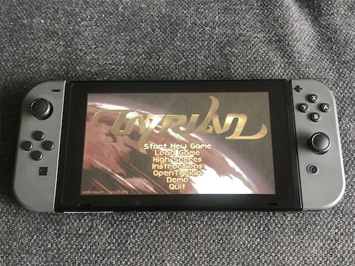
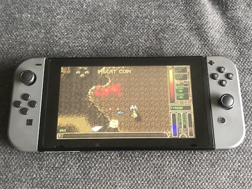

# opentyrian-nx
Port of OpenTryian to the Nintendo Switch

  

Project: https://bitbucket.org/opentyrian/opentyrian/  
Original source: https://bitbucket.org/opentyrian/opentyrian/branch/sdl2

# Installation
Copy `opentyrian.nro` and the `data` folder to your `switch` folder on your microSD card.

# Controls
Left Stick	- ship movement  
A - fire weapons  
B - toggle rear weapon mode  
Y - fire left/right sidekick

# Issues
* In the top menu a single press of a button press will register as two presses